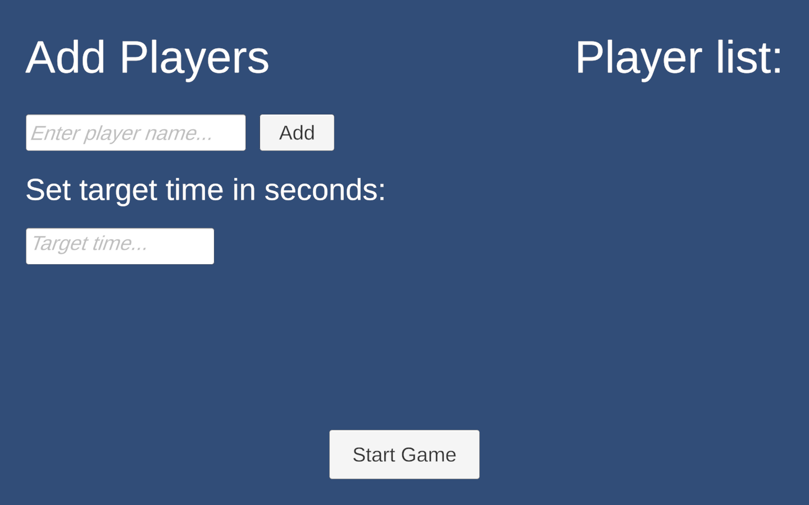
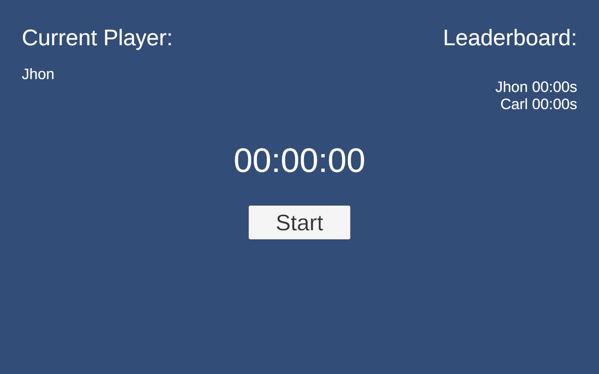

# Stopwatch Veterano

A stopwatch challenge game built with Unity for a youth ministry (Pastoral Juvenil) camp activity.

Players compete to stop a stopwatch as close as possible to a target time. The player with the smallest difference from the target time wins.

> **Latest Release:** v0.2.0

---

## Gameplay

### Tournament Setup

1. Add **2 or more players**.
2. Enter the target time (in seconds).
3. Click **Start Game**.

---

### Tournament Mode

Each player takes turns attempting to stop the stopwatch as close as possible to the target time.

After every turn:

- The next player becomes active.
- The leaderboard updates automatically.
- Players are ranked by the smallest difference from the target time.

Once every player has completed their turn, the tournament ends and you may return to the setup screen to start a new match.

---

## Features

- Tournament mode
- Multiple player support
- Configurable target time
- Live leaderboard
- Automatic ranking based on the closest recorded time
- Restart tournament without restarting the application

---

## Built With

- Unity 6
- C#
